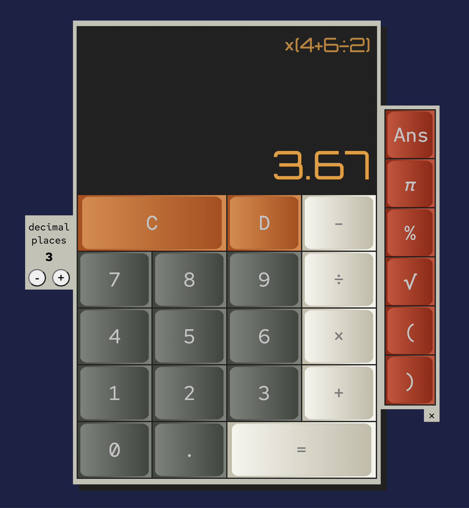

# Calculator by Samuel Jacobs

## Project Overview

The purpose of this project was to develop JavaScript skills, particularly pertaining to interaction with the DOM and the use of functions.

## Design Approach

The design of the calculator required skills including UI Design, HTML, CSS, SCSS, and, mainly, JavaScript.

### HTML and SCSS/CSS

The CSS/SCSS used display: grid to organise the calculator elements. The buttons were organised using flexbox.

A mobile-first approach was taken to designing the calculator, ensuring reponsiveness, hence a consistency of experience regardless of the platform through which the calculator is accessed.

Throughout the project, GitHub was used for version control.

### JavaScript

Query selectors were used to obtain the necessary assets required from the HTML.

A key aspect of the programming of the calculator was that the eval() function was not to be used. Therefore, a series of functions were divised to control the calculator function.
A function called "checkButtonType" was used to determine what kind of button was clicked and what should happen as a result of the click event.

For each type of button, different functions were employed.

Edge cases were assessed and accounted for. For example, if the prefacing operator to the top line of the display was removed using the delete key and followed with by clicking on any number, the user receives visual feedback in the form of changing button colours to demonstrate the next button pressed should be an operator.

Once the basic calculator had been programmed and functioned correctly, additional buttons were added. These buttons include 'Ans', 'π', '%', '√', '(', and ')'.

Integration of Ans, Pi, and %, required basic functions. However, the square root relied on successful implementation of the bracket function. For the bracket function to work, it was necessary to ensure that mathematical opperator precedence (B.I.D.M.A.S.) was followed.

## Potential future improvements

Given the opportunity to further develop the project, below are some additional features that could be added:

- Implement trigonometric functions using JavaScript's Maths library.
- Add an indices button so user's can perform relevant calculations faster.
- Implement a factoral button through the use of a loop.

## Links to project

### Deployed Site

https://samueljacobs98.github.io/calculator-project/

### GitHub Repo

https://github.com/samueljacobs98/calculator-project
